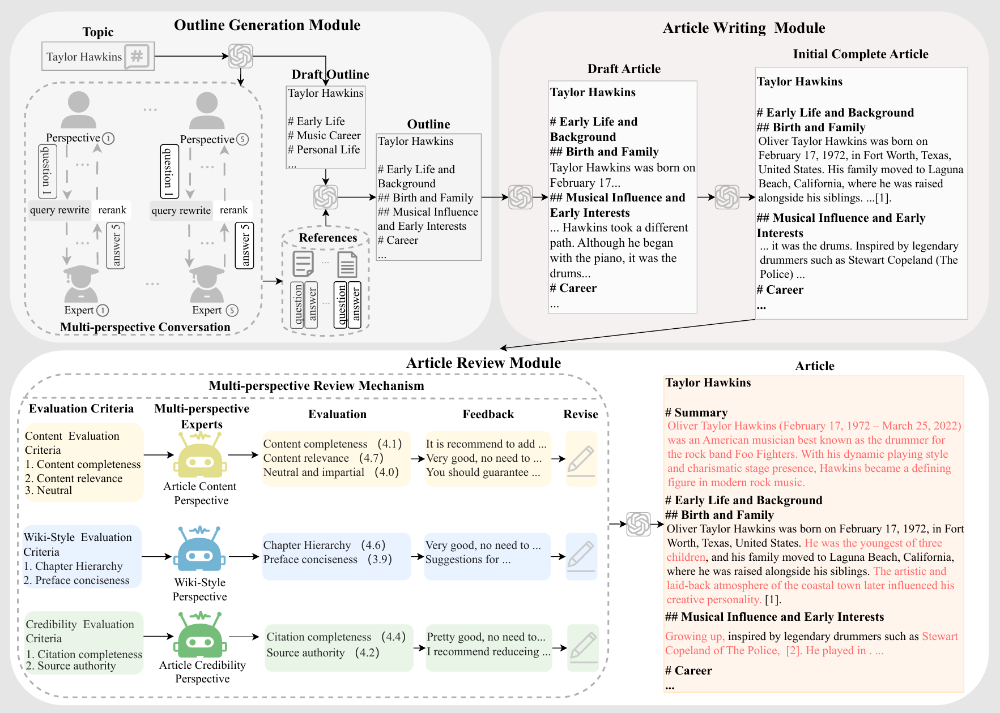

 <h1 align ="center"> WikiREVIEW:A Multi-Perspective Review Framework for Automatic Wiki-Style Article Generation </h1>

Code for the paper "Extractive Medical Entity Disambiguation with Memory Mechanism and Identified Entity Information". 

In this paper, we propose WikiREVIEW, a novel multi-perspective review framework for automatic wiki-style article generation. Specifically, our proposed method introduces multi-perspective experts to review the content of each outline chapter at both chapter and paragraph levels following the initial generation, offering evaluation feedback and continuously refining the numerous deficiencies in the initial long-form article, ultimately achieving high-quality wiki-style article generation.. 



## Setup

### Dependencies:
```bash
conda create -n wiki python=3.11
git clone https://github.com/Stubborn-z/WikiReview.git
cd WikiReview
# Install requirements
pip install -r requirements.txt
```

Run the following command to quickly setup the env needed to run our code:
```bash
bash setup.sh
```
